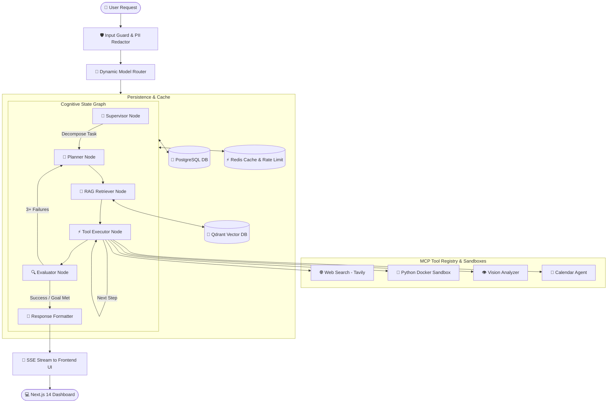

<div align="center">

# 🚀 OmniEngine

**Next-Generation Multi-Agent AI System & Cognitive Engine**

[](https://github.com/shrutiyadav-ai/OmniEngine/actions/workflows/deploy.yml)
[](LICENSE)
[](https://www.python.org/)
[](https://fastapi.tiangolo.com/)
[](https://nextjs.org/)
[](https://www.typescriptlang.org/)
[](https://www.langchain.com/langgraph)
[](https://www.docker.com/)
[](https://kubernetes.io/)

[Architecture](#-system-architecture) •
[Features](#-key-features) •
[Quick Start](#-quick-start) •
[Configuration](#%EF%B8%8F-configuration) •
[API Reference](#-api-reference) •
[Testing](#-testing--quality) •
[Deployment](#-deployment)

---

</div>

## 📌 Overview

**OmniEngine** is an enterprise-grade, multi-agent cognitive AI engine engineered for high-throughput, fault-tolerant context management, dynamic LLM routing, and sandboxed tool execution. Powered by a **LangGraph state graph**, OmniEngine coordinates specialized agent nodes to autonomously solve multi-step reasoning tasks, execute code in isolated Docker environments, retrieve episodic memories via **Qdrant**, and stream real-time responses via Server-Sent Events (SSE).

Designed with production security, financial cost control, and microservice scalability at its core, OmniEngine seamlessly integrates multi-provider routing (OpenAI, Anthropic, Google GenAI), PII redaction, prompt injection guardrails, and sliding-window rate limiting.

---

## 🏗️ System Architecture

OmniEngine coordinates workflow execution through an asynchronous LangGraph state graph. Each request passes through safety guardrails, dynamic model routing, and specialized cognitive nodes:



---

## ✨ Key Features

### 🤖 Multi-Agent Orchestration (LangGraph)
* **Supervisor & Planner**: Decomposes complex user goals into structured, executable step-by-step plans.
* **Autonomous Evaluator**: Monitors step output quality, maintaining execution state and automatically triggering re-planning if tools fail consecutively.
* **Response Formatter**: Synthesizes multi-step tool outputs and streams tokenized Markdown to the user interface.

### 🔀 Dynamic Model Router & Fallback Chain
* **Tier-Based Auto-Routing**: Automatically selects optimal models based on query complexity, token limits, and vision capabilities:
  * **Small Tier**: `gpt-4o-mini` (Fast, lightweight queries)
  * **Medium Tier**: `gpt-4o` (General reasoning & task execution)
  * **Large Tier**: `claude-3-5-sonnet` / `claude-sonnet-4-20250514` (Complex coding & deep analysis)
  * **Reasoning Tier**: `o1` (Math & complex algorithmic logic)
* **Resilient Fallbacks**: Automatically falls back through secondary providers (`gpt-4o` ➔ `claude-sonnet` ➔ `gemini-1.5-pro`) if an API endpoint experiences outages or rate limits.

### 🛠️ Model Context Protocol (MCP) Tool Registry
* **Docker Code Interpreter Sandbox**: Safely executes untrusted Python code in isolated, resource-constrained Docker containers (CPU/Memory limits, disabled external network).
* **Tavily Web Search**: Performs real-time, up-to-date web research and news retrieval.
* **Multi-Modal Vision Analyzer**: Analyzes image attachments, diagrams, charts, and OCR using vision-capable models.
* **Calendar Management Agent**: Schedules, queries, and updates events.

### 🧠 Dual-Tier Memory Architecture
* **Episodic Vector Memory (Qdrant)**: Stores and retrieves high-dimensional semantic embeddings (`text-embedding-3-small`) to enable long-term context retention across chat sessions.
* **Relational State Storage (PostgreSQL)**: Persists session metadata, user messages, token counts, and cost metrics with full async SQLAlchemy ORM.
* **Fast State Caching (Redis)**: Caches active session context, token buckets, and rate-limiting counters.

### 🛡️ Enterprise Security & Guardrails
* **Input Guard**: Real-time detection and blocking of prompt injection attack vectors.
* **PII Redactor**: Automatic scrubbing of sensitive data (Emails, Phone Numbers, SSNs) via Microsoft Presidio and regex fallbacks.
* **Output Guard**: Evaluates response confidence and automatically prepends caution disclaimers when confidence drops below configurable thresholds.

### 💰 Cost Control & Rate Limiting
* **Per-Session & Request Caps**: Enforces strict financial cost caps ($5.00 session cap, $1.00 request cap) with warning alerts at 80% usage.
* **Sliding Window Rate Limiter**: Protects system endpoints using Redis token bucket counters (default: 60 RPM).

---

## 🧰 Tech Stack

| Domain | Technologies |
| :--- | :--- |
| **Backend Framework** | Python 3.11+, FastAPI, Uvicorn, Pydantic v2, AsyncIO |
| **Agent Framework** | LangGraph, LangChain Core |
| **Databases** | PostgreSQL 16 (SQLAlchemy 2.0 Async, Alembic), Qdrant Vector DB, Redis 7 |
| **Frontend UI** | Next.js 14 (App Router), React 18, TypeScript, Tailwind CSS, Lucide Icons, Recharts |
| **Code Execution** | Isolated Docker Engine Sandbox Containers |
| **Linting & Quality** | Ruff, MyPy, ESLint, TypeScript Compiler (`tsc`), Pytest |
| **Infrastructure** | Docker, Docker Compose, Kubernetes, Helm 3 |

---

## ⚡ Quick Start

### Prerequisites
* [Docker Desktop](https://www.docker.com/products/docker-desktop/) (with Docker Compose)
* [Python 3.11+](https://www.python.org/downloads/)
* [Node.js 18+](https://nodejs.org/)

---

### Method 1: One-Command Docker Setup (Recommended)

1. **Clone the Repository**:
   ```bash
   git clone https://github.com/shrutiyadav-ai/OmniEngine.git
   cd OmniEngine
   ```

2. **Configure Environment Variables**:
   Copy `.env.example` to `.env` and add your API keys:
   ```bash
   cp .env.example .env
   ```
   *Edit `.env` to add your `OPENAI_API_KEY`, `ANTHROPIC_API_KEY`, or `GOOGLE_GENAI_API_KEY`.*

3. **Launch All Services**:
   ```bash
   docker-compose up --build
   ```

4. **Access the Applications**:
   * 💻 **Frontend Web Dashboard**: [http://localhost:3000](http://localhost:3000)
   * ⚙️ **Backend REST API**: [http://localhost:8000](http://localhost:8000)
   * 📚 **Interactive Swagger API Docs**: [http://localhost:8000/docs](http://localhost:8000/docs)

---

### Method 2: Manual Local Development

#### 1. Start Infrastructure Services
Using Docker Compose, start PostgreSQL, Redis, and Qdrant:
```bash
docker-compose up -d postgres redis qdrant
```

#### 2. Backend Setup
```bash
# Navigate to repository root
python -m venv .venv
source .venv/bin/activate  # On Windows: .venv\Scripts\activate

# Install dependencies
pip install -e .

# Run database migrations
alembic upgrade head

# Start FastAPI development server
uvicorn backend.main:app --host 0.0.0.0 --port 8000 --reload
```

#### 3. Frontend Setup
```bash
cd frontend

# Install Node modules
npm install

# Start Next.js dev server
npm run dev
```

---

## ⚙️ Configuration

Key configuration parameters managed in `.env`:

| Parameter | Default | Description |
| :--- | :--- | :--- |
| `ENVIRONMENT` | `development` | Application environment (`development` / `production`) |
| `API_SECRET_KEY` | `CHANGE_ME...` | Secret key for JWT & session security |
| `OPENAI_API_KEY` | `sk-...` | OpenAI API key for GPT models & embeddings |
| `ANTHROPIC_API_KEY` | `sk-ant-...` | Anthropic API key for Claude models |
| `GOOGLE_GENAI_API_KEY` | `AQ...` | Google Gemini API key |
| `DATABASE_URL` | `postgresql+asyncpg://...` | PostgreSQL connection string |
| `REDIS_URL` | `redis://localhost:6379/0` | Redis connection string |
| `QDRANT_HOST` | `localhost` | Qdrant Vector database host |
| `SESSION_COST_CAP_USD` | `5.00` | Max spend cap in USD per chat session |
| `RATE_LIMIT_RPM` | `60` | Max API requests per minute per key |

---

## 📡 API Reference

### Core Endpoints

| Method | Endpoint | Description |
| :--- | :--- | :--- |
| `POST` | `/api/v1/chat` | Send message to multi-agent engine (supports SSE streaming) |
| `GET` | `/api/v1/sessions` | List user conversation sessions |
| `POST` | `/api/v1/sessions` | Create a new conversation session |
| `GET` | `/api/v1/sessions/{id}` | Get session details & message history |
| `DELETE` | `/api/v1/sessions/{id}` | Delete conversation session |
| `GET` | `/health` | Kubernetes Liveness probe |
| `GET` | `/health/ready` | Deep Readiness probe (checks Postgres, Redis, Qdrant) |

---

## 🧪 Testing & Quality

OmniEngine enforces strict code quality checks across Python and TypeScript stacks:

```bash
# 1. Run Python Backend Linter
ruff check backend/

# 2. Verify Code Formatting
ruff format backend/ --check

# 3. Static Type Analysis
python -m mypy backend/ --ignore-missing-imports

# 4. Run Pytest Unit & Integration Tests
pytest backend/tests/

# 5. Frontend Type & ESLint Checks
npm --prefix frontend run type-check
npm --prefix frontend run lint
```

---

## 🚢 Deployment

### Kubernetes Deployment via Helm

OmniEngine includes complete production Helm charts located in `infra/k8s/helm/omniengine`.

```bash
# Lint the Helm chart
helm lint infra/k8s/helm/omniengine

# Dry-run template generation
helm template omniengine infra/k8s/helm/omniengine --values infra/k8s/helm/omniengine/values.yaml

# Deploy to Kubernetes cluster
helm upgrade --install omniengine infra/k8s/helm/omniengine \
  --namespace omniengine --create-namespace \
  --set global.environment=production
```

---

## 📄 License

This project is licensed under the [MIT License](LICENSE).

---

<div align="center">

Made with ❤️ by the **OmniEngine Team**.

</div>
